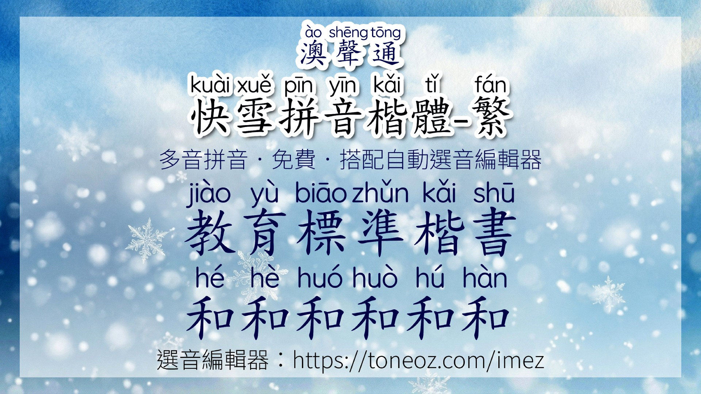
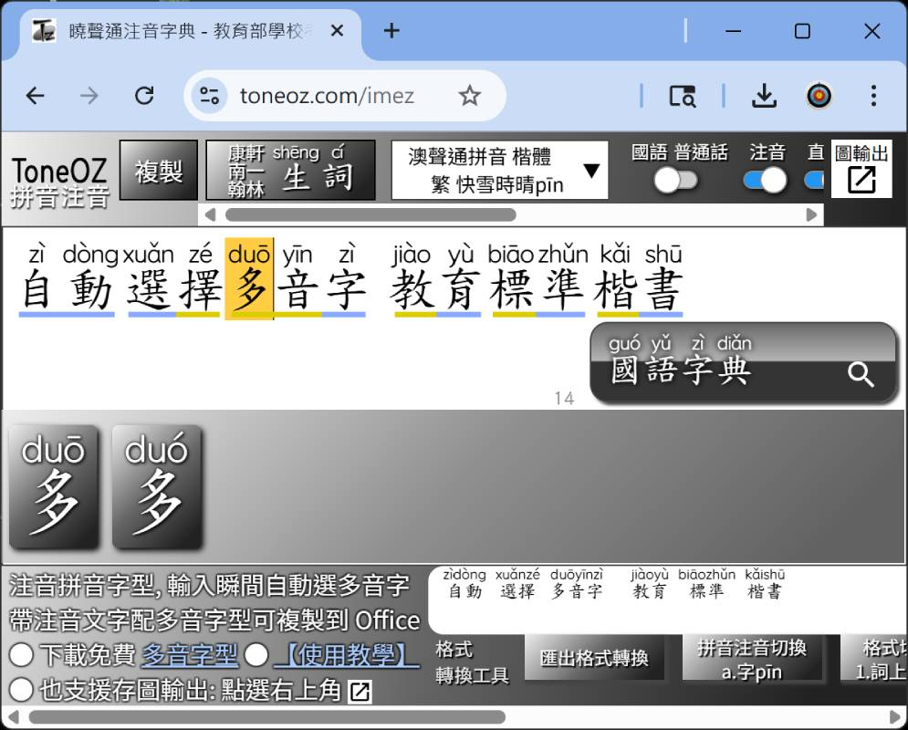
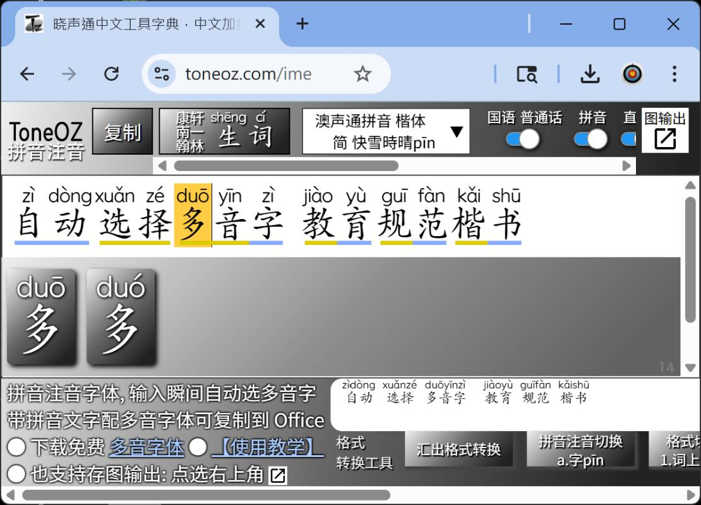

# 澳聲通 快雪拼音楷體字型-繁體版 ToneOZ QuickSnow Pinyin Kai Traditional

---

## 簡介

漢字頭上帶拼音的字體，結合漢語拼音與教育部標準楷體，採用圓體大字澳聲通「[Quicksnow 快雪時晴](https://github.com/jeffreyxuan/toneoz-font-quicksnow)」英數拼音字體，支援一字多音破音字，致力於呈現接近高品質教科書等級的閱讀體驗。提供免費、免安裝的 **「曉聲通注音國語字典」拼音／注音編輯器**，支援多音字自動校正：

[https://toneoz.com/imez](https://toneoz.com/imez)

編輯器亦可配合教學方案，切換國語與普通話的兩岸差異讀音，方便教師依不同教學情境靈活運用。

---

## 您的支持

請幫忙寫推薦文章。真的，這很重要。

現在市面上很多拼音字體仍然只有單一發音，但因為歷史悠久、網路上的資料多，使用者搜尋「拼音字體」時，往往先找到這些字體。久而久之，錯誤或不完整的拼音反而變成常態。

如果澳聲通拼音字體對您有幫助，懇請您在公開網站寫一篇介紹或推薦文章。最好能用您自己的話語，分享實際的教學經驗、使用情境或觀察。這樣的文章內容更充實，也更容易被搜尋系統視為有價值的分享，讓更多人看見澳聲通，並改善整個網路環境中的拼音教學品質。

---

## 字型下載

  [https://toneoz.com/blog/quicksnow](https://toneoz.com/blog/quicksnow)

---

## 漢字配拼音字體線上展示：  
  請在字型選單中選「快雪」系列：  
  [https://toneoz.com/imez](https://toneoz.com/imez)
  
  

  

---

## 特色

- 免費、開源、可商用。**OFL（Open Font License）** 授權釋出，可安心使用，無須額外付費。
- 課本就長這樣，教育標準筆形
- 漢字上方拼音部分使用動態字寬排版，符合英語閱讀體驗
- 小尺寸時仍維持高識別度
- 筆畫易辨識
- 拼音字體與正文做出功能區隔
- 支援破音字一字多音
- 相容 [IVS 字嗨注音規格](https://github.com/ButTaiwan/bpmfvs)，字型切換時讀音不會跑掉

---

## 漢字頭上的拼音：澳聲通「[Quicksnow 快雪時晴](https://github.com/jeffreyxuan/toneoz-font-quicksnow)」英數拼音字體

對學習台語、客語等本土語言，以及以拼音學中文的外國學習者來說，羅馬字拼音特別重要。因為正文通常用明體或黑體，出版時常會另外用較好辨識的圓體來做標音，讓讀者一看就知道那是發音資訊。

這類字體會盡量做得清楚、單純、好認，也要支援各語種教學需要的拼音符號。

為了輔助教材製作，澳聲通 ToneOZ 特別開發，謹呈「[Quicksnow 快雪時晴](https://github.com/jeffreyxuan/toneoz-font-quicksnow)」系列拼音字體。

 

澳聲通 [快雪時晴 QuickSnow](https://github.com/jeffreyxuan/toneoz-font-quicksnow) 英數字體，是改作自 Google Fonts 的開源字體 [Quicksand](https://fonts.google.com/specimen/Quicksand?preview.script=Latn) 「流沙」。

Quicksand 這套字最早由菲律賓裔、旅居杜拜的設計師 Andrew Paglinawan 於 2008 年發起；2016 年再由愛爾蘭／埃及裔設計師 Thomas Jockin 改進字體品質；2019 年則由旅居紐約的南斯拉夫裔設計師 Mirko Velimirovic 製作可變字重版本。

在這樣的跨國團隊接力下，Quicksand 原本就對西歐、南歐拉丁字母和越南文有不錯的支援。

---

## 母字體

- 繁體拼音漢字免費商用授權來自 : 全字庫正楷體  
  [《Open Government Data License, version 1.0》](https://data.gov.tw/en/licenses)
- 正文漢字中的英數字符部分是基於「[FONTWORKS Klee One](https://github.com/fontworks-fonts/Klee)」以及「[LXGW 霞鶩文楷](https://github.com/lxgw/LxgwWenKai)」，採用 SIL Open Font License 1.1 免費商用授權。

---

## 鼓勵或建言

作者 : Jeffrey Xuan
- Email: [jeffreyx@gmail.com](mailto:jeffreyx@gmail.com)
- Facebook 討論區: [曉聲通國語字典](https://www.facebook.com/groups/apptoneoz)
- WeChat: [chihlinhsuan](https://weixin.qq.com/)
- LINE: [jeffreyxiphone2018](https://line.me/)
